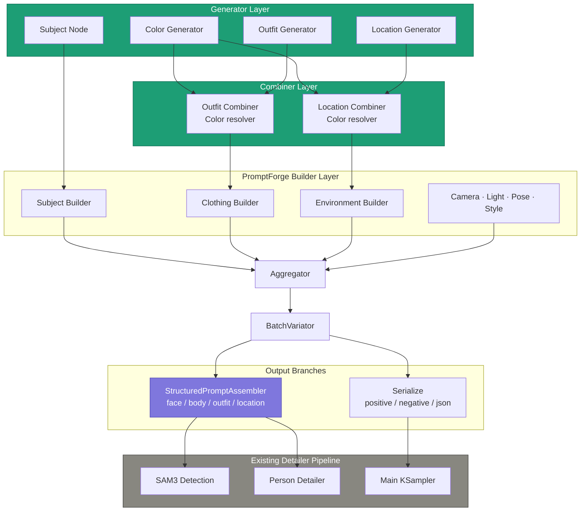

# ComfyUI PromptForge — Generators & Structured Prompting Extension

> **Companion-Spec zu** `ComfyUI-PromptForge-SPEC.md`
> **Schema-Version:** 1.0 (kompatibel mit Haupt-Spec v1.0)
> **Status:** Draft 1
> **Scope:** Generator-Layer (Outfit, Location, Color), Structured Prompt Assembly für Detailer-Pipelines, Spatial Region Map, UI-Visualisierung
> **Ausdrücklich nicht in dieser Spec:** Detailer-Implementation (bestehend: SAM3-Detection + Person Detailer), KSampler-Anbindung

---

## 1. Einordnung & Abgrenzung

Die Haupt-SPEC beschreibt die generische PromptForge-Pipeline (Builder → Aggregator → Serialize → Encoder). Diese Erweiterung ergänzt **datengetriebene Generator-Nodes** für Outfit, Location und Color sowie einen **StructuredPromptAssembler**, der den finalen `PROMPT_DICT` in regionale Teilprompts zerlegt — speziell zugeschnitten auf einen bereits existierenden Detailer-Stack mit SAM3-Detection und Person Detailer.

```
[Haupt-SPEC]                    [Diese Spec]
PromptForge Core         ←   Generator Layer
  Builder, Aggregator,         Outfit / Location / Color Gen
  Serialize, BatchVariator     OUTFIT_DICT, LOCATION_DICT,
                               COLOR_PALETTE_DICT als typisierte
                               Inputs für die Builder

                          ←   Structured Prompt Assembler
                               Zerlegt PROMPT_DICT in
                               face / body / outfit / location
                               STRINGS für Detailer-Pipeline
```

**Was schon existiert** (bleibt unangetastet):
- ColorGen (erzeugt N Farben in einem Style — wird hier *erweitert*, nicht ersetzt)
- OutfitGen mit txt-basierten Garment-Pools (wird *integriert* und sein Output umgebaut)
- ColorCombiner (gibt heute String aus — wird *umgebaut*, gibt künftig Dict aus)
- SAM3-basierter Detection-Detailer + Person Detailer für Mask-Refinement

**Was diese Spec hinzufügt:**
- LocationGen (neu, vollständig analog zu OutfitGen)
- ColorCombiner-Umbau: STRING → OUTFIT_DICT
- LocationCombiner (neu, analog zum Outfit-Umbau)
- StructuredPromptAssembler (neu, das Bindeglied zur Detailer-Pipeline)
- Spatial Region Map als optionales Metadatenfeld
- Frontend-Widgets zur Visualisierung von Outfit, Location und Region Map

---

## 2. Vision & Designprinzipien

1. **Generatoren liefern Dicts, nicht Strings.** Jede Generator-Node gibt einen typisierten Dict raus, der aufgelöste Prompt-Fragmente, Metadaten (coverage, fabric, layer-Tiefe) und optional spatial hints enthält. Das Combiner-Pattern (Color × Garment → String) wird ersetzt durch (Color × Garment → enriched Dict).
2. **Eine Datenquelle, viele Verbraucher.** Derselbe `OUTFIT_DICT` füttert (a) den ClothingBuilder in PromptForge, (b) den StructuredPromptAssembler, (c) die UI-Vorschau und (d) den Sidecar-Saver. Keine Dopplung.
3. **Geteilte Color-Palette zwischen Outfit und Location.** Ein einziger ColorGen produziert sowohl Garment-Tokens (`#primary#`, `#secondary#`) als auch Atmosphere-Tokens (`#ambient_light#`, `#shadow_tone#`). Das hält Outfit und Location farblich kohärent.
4. **Spatial Info als optionales Metadatenfeld.** Jeder regionale Prompt-Fragment kann eine `region_hint` mitführen (relative Bounding-Box, Layer-Tiefe). Das ist *nicht* zur Maskenerzeugung gedacht — SAM3 macht das — sondern für UI-Vorschau, Mask-Klassen-Mapping und Fallback bei fehlgeschlagener Detection.
5. **Tier-basiertes Structural Prompting.** Jeder Output-Prompt (face, body, outfit, location) folgt einer festen Token-Reihenfolge nach Attention-Priorität, kein Free-Form-String-Konkatenat.
6. **Detailer-bereit, aber Detailer-agnostisch.** Die regionalen Strings sind so strukturiert, dass sie ohne weitere Anpassung in den existierenden SAM3+PersonDetailer-Stack passen, aber genauso in ADetailer, Impact-FaceDetailer oder regionale Conditioning-Setups eingesetzt werden können.

---

## 3. Architektur-Übersicht



**Datenflüsse zwischen den neuen Komponenten:**

| Quelle | Datentyp | Verbraucher |
|---|---|---|
| ColorGen | `COLOR_PALETTE_DICT` | OutfitCombiner, LocationCombiner |
| OutfitGen | `OUTFIT_DICT_RAW` (mit `#token#`) | OutfitCombiner |
| OutfitCombiner | `OUTFIT_DICT` (resolved) | ClothingBuilder, StructuredPromptAssembler |
| LocationGen | `LOCATION_DICT_RAW` | LocationCombiner |
| LocationCombiner | `LOCATION_DICT` (resolved) | EnvironmentBuilder, StructuredPromptAssembler |
| Aggregator | `PROMPT_DICT` | StructuredPromptAssembler, Serialize |
| StructuredPromptAssembler | 4× `STRING` + 1× `REGION_MAP` | Existing Detailer Pipeline |

---

## 4. Neue Datentypen

Alle Datentypen werden als Pydantic-Modelle in `promptforge/schema.py` ergänzt und als ComfyUI-Custom-Types in `promptforge/types.py` registriert.

### 4.1 `COLOR_PALETTE_DICT`

```python
class ColorPalette(BaseModel):
    seed: int = 0
    style: str = "neutral"                       # z.B. "warm earthy", "monochrome cool"
    garment_colors: dict[str, str] = Field(default_factory=dict)
    # → {"primary": "burgundy", "secondary": "charcoal", "accent": "ivory"}
    atmosphere_colors: dict[str, str] = Field(default_factory=dict)
    # → {"ambient_light": "warm amber afternoon", "shadow_tone": "deep cool blue"}
    raw_tokens: dict[str, str] = Field(default_factory=dict)
    # → {"#primary#": "burgundy", "#ambient_light#": "warm amber afternoon", ...}
```

### 4.2 `OUTFIT_DICT`

```python
class GarmentEntry(BaseModel):
    name: str                                    # z.B. "fitted blazer"
    probability: float                           # aus txt-File
    coverage: float                              # aufgelöst aus Range, z.B. 0.7
    fabric: str                                  # z.B. "wool blend"
    color_role: str                              # "primary" | "secondary" | "accent"
    color_resolved: Optional[str] = None         # nach Combiner-Pass: "burgundy"
    prompt_fragment: str = ""                    # finaler resolved string
    region_hint: Optional[dict] = None           # spatial info, siehe §8

class OutfitDict(BaseModel):
    set_name: str                                # "female_office_with_skirts"
    seed: int
    formality: Literal["casual", "smart_casual", "formal", "evening", "sport"]
    coverage_target: float                       # 0.0–1.0
    color_tone: Optional[str] = None             # "warm", "cool", "monochrome"
    garments: dict[str, GarmentEntry] = Field(default_factory=dict)
    # Keys: "headwear", "upper_body", "lower_body", "legwear",
    #       "footwear", "bag", "accessory"
```

### 4.3 `LOCATION_DICT`

Analog zu `OUTFIT_DICT`:

```python
class LocationElement(BaseModel):
    name: str
    probability: float
    coverage: float                              # wie "Bildanteil", 0.0–1.0
    texture: Optional[str] = None                # analog zu fabric
    layer: Literal["background", "midground", "foreground", "atmosphere"]
    prompt_fragment: str = ""
    region_hint: Optional[dict] = None

class LocationDict(BaseModel):
    set_name: str                                # "urban_brutalist", "beach_mediterranean"
    seed: int
    color_tone: Optional[str] = None
    elements: dict[str, LocationElement] = Field(default_factory=dict)
    # Keys: "background", "midground", "foreground_element",
    #       "architecture_detail", "props", "time_of_day", "weather"
```

### 4.4 `SUBJECT_DICT` (Erweiterung)

```python
class SubjectDict(BaseModel):
    id: str = "subject_1"
    age_desc: str                                # "young", "middle-aged"
    gender: str                                  # "woman", "man", "androgynous person"
    ethnicity_tag: Optional[str] = None
    skin_tags: list[str] = Field(default_factory=lambda: ["smooth skin"])
    eye_desc: Optional[str] = None
    brow_desc: Optional[str] = None
    lip_desc: Optional[str] = None
    nose_desc: Optional[str] = None
    expression: str = "neutral expression"
    hair_color_length: Optional[str] = None      # für face_prompt-Anker (kurz)
    hair_full: Optional[dict] = None             # für body_prompt (vollständig)
    body_build: Optional[str] = None
    body_height: Optional[str] = None
    pose_hint: Optional[str] = None
```

### 4.5 `STRUCTURED_PROMPTS`

Output-Container des Assemblers — wird sowohl als 4 separate STRINGs als auch als kombinierter Dict ausgegeben:

```python
class StructuredPrompts(BaseModel):
    face: str
    body: str
    outfit: str
    location: str
    region_map: list["RegionEntry"] = Field(default_factory=list)
    raw_dict: dict = Field(default_factory=dict)   # Original PROMPT_DICT
```

### 4.6 `REGION_MAP`

Siehe §8 — pro Prompt-Fragment optional eine räumliche Annotation.

```python
class RegionEntry(BaseModel):
    region_id: str                               # "face", "upper_body", "background"
    sam_class_hint: Optional[str] = None         # Klassen-Label für SAM3-Mapping
    bbox_relative: Optional[tuple[float, float, float, float]] = None
    # (x_min, y_min, x_max, y_max) in [0, 1]
    layer_depth: Literal["background", "midground", "foreground", "subject"] = "subject"
    prompt_fragment: str = ""
```

---

## 5. Generator Nodes

### 5.1 ColorGenerator (Erweiterung)

Der bestehende ColorGen produziert N Farben in einem Style. Erweiterung: er gibt jetzt zusätzlich einen strukturierten `COLOR_PALETTE_DICT` aus, der sowohl Garment- als auch Atmosphere-Tokens enthält.

```python
class PromptForge_ColorGenerator:
    CATEGORY = "PromptForge/Generators"
    RETURN_TYPES = ("COLOR_PALETTE_DICT", "STRING")
    RETURN_NAMES = ("color_palette", "palette_summary")
    FUNCTION = "generate"

    @classmethod
    def INPUT_TYPES(cls):
        return {
            "required": {
                "style":          ("STRING", {"default": "neutral warm"}),
                "seed":           ("INT", {"default": 0, "min": 0, "max": 0xFFFFFFFFFFFFFFFF}),
                "palette_mode":   (["garment_only", "atmosphere_only", "full"],
                                   {"default": "full"}),
                "n_garment":      ("INT", {"default": 3, "min": 1, "max": 6}),
                "n_atmosphere":   ("INT", {"default": 2, "min": 0, "max": 4}),
            },
        }

    def generate(self, style, seed, palette_mode, n_garment, n_atmosphere):
        # Bestehende Color-Generation-Logik (Vorhandene LLM-Anbindung beibehalten)
        # NEU: gibt zusätzlich strukturierte Tokens zurück
        ...
```

**Token-Mapping:**

| Token | Rolle | Verbraucher |
|---|---|---|
| `#primary#` | Hauptfarbe (z.B. Oberteil) | Outfit |
| `#secondary#` | Sekundärfarbe (z.B. Hose) | Outfit |
| `#accent#` | Akzent (Schuhe, Tasche) | Outfit |
| `#tertiary#` | Optional vierte Farbe | Outfit |
| `#ambient_light#` | Lichtfarbe der Szene | Location |
| `#shadow_tone#` | Schattenfarbe | Location |

### 5.2 OutfitGenerator (Integration)

Bestehender Node aus dem anderen Projekt — wird in PromptForge integriert. **Wichtige Änderung:** der Output ist jetzt `OUTFIT_DICT` statt String.

```python
class PromptForge_OutfitGenerator:
    CATEGORY = "PromptForge/Generators"
    RETURN_TYPES = ("OUTFIT_DICT_RAW",)
    RETURN_NAMES = ("outfit_raw",)

    @classmethod
    def INPUT_TYPES(cls):
        return {
            "required": {
                "set_name":       ("STRING", {"default": "female_office_with_skirts"}),
                "formality":      (["casual", "smart_casual", "formal", "evening", "sport"],
                                   {"default": "smart_casual"}),
                "coverage_target": ("FLOAT", {"default": 0.7, "min": 0.0, "max": 1.0,
                                              "step": 0.05}),
                "color_tone":     ("STRING", {"default": "warm"}),
                "seed":           ("INT", {"default": 0, "min": 0,
                                           "max": 0xFFFFFFFFFFFFFFFF}),
                "headwear":       ("BOOLEAN", {"default": False}),
                "upper_body":     ("BOOLEAN", {"default": True}),
                "lower_body":     ("BOOLEAN", {"default": True}),
                "legwear":        ("BOOLEAN", {"default": True}),
                "footwear":       ("BOOLEAN", {"default": True}),
                "bag":            ("BOOLEAN", {"default": False}),
                "accessory":      ("BOOLEAN", {"default": False}),
            },
        }
```

**Internes Verhalten:**

1. Lädt für jede aktivierte Region die zugehörige txt-Datei aus `wildcards/outfits/<set_name>/<region>.txt`.
2. Wählt deterministisch per Seed eine Zeile basierend auf den `probability`-Werten.
3. Resolved den `coverage`-Range zu einem konkreten Wert (uniform random innerhalb der Range, gleicher Seed).
4. Weist eine `color_role` zu (primary für upper_body, secondary für lower_body, accent für footwear, etc. — konfigurierbar).
5. Baut das `prompt_fragment` mit `#primary#`-Platzhaltern (noch *nicht* aufgelöst).

**Output-Beispiel** (vor Combiner):

```python
{
  "set_name": "female_office_with_skirts",
  "seed": 42,
  "formality": "formal",
  "coverage_target": 0.75,
  "color_tone": "warm",
  "garments": {
    "upper_body": {
      "name": "fitted blazer",
      "probability": 0.6,
      "coverage": 0.78,
      "fabric": "wool blend",
      "color_role": "primary",
      "color_resolved": None,
      "prompt_fragment": "fitted wool blend blazer in #primary#, tailored lapels",
      "region_hint": {
        "region_id": "upper_body",
        "sam_class_hint": "upper_clothes",
        "bbox_relative": [0.20, 0.15, 0.80, 0.55],
        "layer_depth": "subject"
      }
    },
    "lower_body": { ... },
    "footwear":   { ... }
  }
}
```

### 5.3 LocationGenerator (NEU, vollständig analog)

```python
class PromptForge_LocationGenerator:
    CATEGORY = "PromptForge/Generators"
    RETURN_TYPES = ("LOCATION_DICT_RAW",)
    RETURN_NAMES = ("location_raw",)

    @classmethod
    def INPUT_TYPES(cls):
        return {
            "required": {
                "set_name":    ("STRING", {"default": "urban_brutalist"}),
                "color_tone":  ("STRING", {"default": "warm"}),
                "seed":        ("INT", {"default": 0, "min": 0,
                                        "max": 0xFFFFFFFFFFFFFFFF}),
                "background":           ("BOOLEAN", {"default": True}),
                "midground":            ("BOOLEAN", {"default": False}),
                "foreground_element":   ("BOOLEAN", {"default": True}),
                "architecture_detail":  ("BOOLEAN", {"default": False}),
                "props":                ("BOOLEAN", {"default": False}),
                "time_of_day":          ("BOOLEAN", {"default": True}),
                "weather":              ("BOOLEAN", {"default": True}),
            },
        }
```

**Output-Beispiel:**

```python
{
  "set_name": "urban_brutalist",
  "seed": 42,
  "color_tone": "warm",
  "elements": {
    "background": {
      "name": "large concrete wall, geometric panel lines",
      "probability": 0.8,
      "coverage": 0.72,
      "texture": "raw concrete, aggregate finish",
      "layer": "background",
      "prompt_fragment": "large plain light-gray concrete wall with subtle geometric panel lines, raw concrete texture, illuminated by #ambient_light#",
      "region_hint": {
        "region_id": "background",
        "sam_class_hint": "background",
        "bbox_relative": [0.0, 0.0, 1.0, 0.7],
        "layer_depth": "background"
      }
    },
    "foreground_element": {
      "name": "wide concrete staircase",
      "coverage": 0.18,
      "layer": "foreground",
      "prompt_fragment": "wide concrete steps with visible rough texture in #shadow_tone#",
      "region_hint": {
        "region_id": "foreground",
        "bbox_relative": [0.0, 0.7, 1.0, 1.0],
        "layer_depth": "foreground"
      }
    },
    "time_of_day": {
      "name": "bright overcast midday",
      "prompt_fragment": "bright diffused natural daylight, soft even lighting"
    },
    "weather": { ... }
  }
}
```

### 5.4 OutfitCombiner (Umbau: STRING → DICT)

**Bisheriges Verhalten:** nimmt `OutfitGen`-String + `ColorGen`-Farben, gibt fertigen Prompt-String aus.

**Neues Verhalten:** nimmt `OUTFIT_DICT_RAW` + `COLOR_PALETTE_DICT`, ersetzt alle `#token#`-Platzhalter in den `prompt_fragment`-Strings, gibt `OUTFIT_DICT` (resolved) aus.

```python
class PromptForge_OutfitCombiner:
    CATEGORY = "PromptForge/Generators"
    RETURN_TYPES = ("OUTFIT_DICT", "STRING")
    RETURN_NAMES = ("outfit_dict", "combined_summary")

    @classmethod
    def INPUT_TYPES(cls):
        return {
            "required": {
                "outfit_raw":    ("OUTFIT_DICT_RAW",),
                "color_palette": ("COLOR_PALETTE_DICT",),
            },
        }

    def combine(self, outfit_raw, color_palette):
        resolved = copy.deepcopy(outfit_raw)
        for region, garment in resolved["garments"].items():
            fragment = garment["prompt_fragment"]
            for token, value in color_palette.raw_tokens.items():
                fragment = fragment.replace(token, value)
            garment["prompt_fragment"] = fragment
            # color_resolved direkt setzen, basierend auf color_role
            role = garment["color_role"]
            garment["color_resolved"] = color_palette.garment_colors.get(role)
        summary = self._build_summary(resolved)
        return resolved, summary
```

### 5.5 LocationCombiner (NEU, analog)

Identisches Pattern für `LOCATION_DICT_RAW` + `COLOR_PALETTE_DICT` → `LOCATION_DICT`. Ersetzt `#ambient_light#`, `#shadow_tone#` etc.

---

## 6. Datenfile-Format für Generator-Pools

### 6.1 Garment-Pool (Outfit)

Pfad: `wildcards/outfits/<set_name>/<region>.txt`

```
# wildcards/outfits/female_office_with_skirts/upper_body.txt
# Format: name | probability | coverage_range | fabric_or_texture
fitted blazer                          | 0.6 | 0.6-0.9 | wool blend, structured
crisp button-up blouse                 | 0.5 | 0.5-0.8 | poplin cotton, silk
fine knit turtleneck                   | 0.3 | 0.7-0.9 | merino wool, cashmere
sleeveless silk shell                  | 0.2 | 0.4-0.7 | silk charmeuse
```

```
# wildcards/outfits/female_office_with_skirts/footwear.txt
pointy closed toe high heel pumps      | 0.5 | 0.1-0.3 | patent leather, suede, pvc
block heel mary janes                  | 0.3 | 0.1-0.3 | smooth leather
loafers                                | 0.2 | 0.1-0.3 | leather, suede
```

**Erweiterte Templating-Syntax** (optional, in den `name`- und `fabric`-Spalten):

```
fitted #fabric_choice# blazer in #primary#  | 0.5 | 0.6-0.9 | wool blend, twill, gabardine
```

Der Generator wählt aus der `fabric`-Spalte einen Wert (zufällig per Seed) und ersetzt `#fabric_choice#`. So entstehen pro Generation kleine Varianten ohne neue Zeilen.

### 6.2 Location-Pool

Pfad: `wildcards/locations/<set_name>/<element>.txt`

```
# wildcards/locations/urban_brutalist/background.txt
large concrete wall, geometric panel lines | 0.8 | 0.4-1.0 | raw concrete, aggregate finish
glass-and-steel brutalist facade           | 0.3 | 0.3-0.9 | reflective modernist surface
weathered poured concrete exterior         | 0.5 | 0.3-0.8 | rough formwork texture
```

```
# wildcards/locations/urban_brutalist/foreground_element.txt
wide concrete staircase                    | 0.7 | 0.0-0.3 | textured aggregate
raised brutalist plaza platform            | 0.4 | 0.0-0.2 | smooth brushed concrete
low concrete retaining wall                | 0.3 | 0.0-0.2 | raw poured concrete
```

```
# wildcards/locations/urban_brutalist/time_of_day.txt
bright overcast midday                     | 0.5 | - | -
golden hour late afternoon                 | 0.3 | - | -
soft morning daylight                      | 0.2 | - | -
```

(Bei Elementen ohne sinnvolle Coverage/Texture: `-` als Platzhalter, wird vom Parser ignoriert.)

### 6.3 YAML-Variante (für strukturierte Sets mit Metadaten)

Pfad: `wildcards/outfits/<set_name>/_meta.yaml`

```yaml
set_name: female_office_with_skirts
default_color_roles:
  upper_body: primary
  lower_body: secondary
  legwear: tertiary
  footwear: accent
  bag: accent
formality_filters:
  casual:    { upper_body: ["sleeveless silk shell", "crisp button-up blouse"] }
  formal:    { upper_body: ["fitted blazer", "fine knit turtleneck"] }
default_region_hints:
  upper_body:  { sam_class: upper_clothes,  bbox: [0.20, 0.15, 0.80, 0.55] }
  lower_body:  { sam_class: skirt,          bbox: [0.25, 0.45, 0.75, 0.85] }
  legwear:     { sam_class: legs,           bbox: [0.30, 0.65, 0.70, 0.95] }
  footwear:    { sam_class: shoes,          bbox: [0.30, 0.90, 0.70, 1.00] }
```

Der Generator lädt zuerst `_meta.yaml` (falls vorhanden), dann die entsprechenden txt-Dateien. Die `_meta.yaml` ist optional — ohne sie greifen Defaults aus `promptforge/defaults.py`.

---

## 7. Structural Prompting — Tier-Modell

Jeder vom StructuredPromptAssembler erzeugte regionale Prompt folgt einer festen Tier-Reihenfolge. Frühere Tokens bekommen höhere Attention; deshalb entscheidet die Reihenfolge über das Ergebnis.

### 7.1 `face_prompt` — Tiers

| Tier | Inhalt | Beispiel-Tokens |
|---|---|---|
| 1 | Charakter-Anker | `young woman` |
| 2 | Haut & Ethnizität | `east asian, smooth skin, detailed skin texture` |
| 3 | Gesichtszüge | `(bright green almond eyes:1.1), arched brows, full lips` |
| 4 | Ausdruck & Makeup | `neutral expression, natural office makeup` |
| 5 | Haar-Anker (kurz) | `dark auburn hair` |
| 6 | Quality-Tags (face-spezifisch) | `sharp focus, detailed face, high quality` |

**Bewusst ausgeschlossen:** Kleidung, Pose, vollständiges Hairstyle, globale Style-Tags, Hintergrund.

**Code-Skelett:**

```python
def _build_face(self, subject: SubjectDict, outfit: OutfitDict) -> str:
    parts = [f"{subject.age_desc} {subject.gender}"]
    if subject.ethnicity_tag:
        parts.append(subject.ethnicity_tag)
    parts.extend(subject.skin_tags)
    if subject.eye_desc:
        parts.append(f"({subject.eye_desc}:1.1)")
    for k in ("brow_desc", "lip_desc", "nose_desc"):
        if v := getattr(subject, k, None):
            parts.append(v)
    parts.append(subject.expression)
    if mk := outfit.get("makeup_style"):
        parts.append(mk)
    if subject.hair_color_length:
        parts.append(subject.hair_color_length)
    parts.append("sharp focus, detailed face, high quality")
    return ", ".join(p for p in parts if p)
```

### 7.2 `body_prompt` — Tiers

| Tier | Inhalt | Beispiel-Tokens |
|---|---|---|
| 1 | Charakter-Anker (kurz, identisch zu face) | `young woman` |
| 2 | Body-Build & Höhe | `slim build, average height` |
| 3 | Pose | `seated on wide steps, slight S-curve, leaning back` |
| 4 | Hände (oft Schwachstelle) | `(detailed hands:1.05), natural finger position` |
| 5 | Haar (vollständig) | `long straight dark auburn hair, center-parted, waist-length` |
| 6 | Haut (Körperbereiche) | `smooth skin, natural skin texture` |
| 7 | Quality-Tags (anatomie-spezifisch) | `correct anatomy, natural proportions` |

**Bewusst ausgeschlossen:** Kleidung im Detail (kommt aus `outfit_prompt`), Gesichtszüge, Hintergrund.

### 7.3 `outfit_prompt` — Tiers (Spatial Order: head → toe)

| Tier | Inhalt | Reihenfolge |
|---|---|---|
| 1 | Headwear (falls aktiv) | oben |
| 2 | Upper Body | |
| 3 | Lower Body / Skirt / Pants | |
| 4 | Legwear | |
| 5 | Footwear | unten |
| 6 | Bag (seitlich) | |
| 7 | Accessories (Schmuck etc.) | |
| 8 | Style-Modifier (formality, era) | letzte Position |

```python
def _build_outfit(self, outfit: OutfitDict) -> str:
    spatial_order = ["headwear", "upper_body", "lower_body", "legwear",
                     "footwear", "bag", "accessory"]
    parts = []
    for region in spatial_order:
        if region in outfit.garments:
            parts.append(outfit.garments[region].prompt_fragment)
    if outfit.formality:
        parts.append(f"{outfit.formality} style")
    return ", ".join(parts)
```

### 7.4 `location_prompt` — Tiers (Layer Order: bg → fg → atmosphere)

| Tier | Inhalt | Layer |
|---|---|---|
| 1 | Background | hinten (höchste Coverage) |
| 2 | Midground | |
| 3 | Architecture Detail / Props | |
| 4 | Foreground Element | vorne |
| 5 | Time of Day | atmosphäre |
| 6 | Weather | atmosphäre |

```python
def _build_location(self, location: LocationDict) -> str:
    layer_order = ["background", "midground", "architecture_detail", "props",
                   "foreground_element", "time_of_day", "weather"]
    parts = []
    for elem_key in layer_order:
        if elem_key in location.elements:
            parts.append(location.elements[elem_key].prompt_fragment)
    return ", ".join(parts)
```

---

## 8. Spatial Region Map

### 8.1 Zweck (was die Region Map ist und nicht ist)

Die `region_hint` an einem Garment oder Location-Element ist ein **deklaratives Metadatenfeld**, kein Maskenerzeuger. Sie sagt "dieses Garment liegt typischerweise im Bereich (0.2, 0.15, 0.8, 0.55) und wird vom SAM3-Detektor wahrscheinlich als `upper_clothes` klassifiziert".

**Was die Region Map ermöglicht:**

1. **UI-Vorschau:** Die Frontend-Widgets zeigen eine Silhouette mit eingefärbten Regionen, sodass der User sofort sieht, *welches* Garment auf *welcher* Körperregion liegt.
2. **SAM3-Klassen-Mapping:** Wenn der existierende SAM3-Detector eine Maske mit Klasse `upper_clothes` liefert, mapped der Detailer-Adapter automatisch das `upper_body`-Fragment aus `OUTFIT_DICT` darauf — ohne dass der User die Verbindung manuell ziehen muss.
3. **Fallback-Conditioning:** Falls SAM3 für eine bestimmte Klasse keine Maske findet (z.B. footwear bei abgeschnittenem Bildausschnitt), kann ein nachgelagerter Regional-Prompter die `bbox_relative` als Soft-Region nutzen.
4. **Sidecar-Logging:** Die Region Map landet im JSON-Sidecar neben dem Output-Bild — wertvoll für spätere Datensatz-Analyse oder Re-Generation.

**Was die Region Map nicht ist:**

- Keine echte Maske, keine Polygone, keine Pixel.
- Kein Ersatz für SAM3 — Detection bleibt der präzisere Mechanismus.
- Kein Constraint für den KSampler — die bbox wird *nicht* in das Conditioning eingespeist (außer optional als latent-space-Hint, das ist Phase 2).

### 8.2 Standard-Region-Hints

Defaults in `promptforge/defaults.py`:

```python
DEFAULT_PERSON_REGIONS = {
    "face":       {"sam_class": "face",          "bbox": (0.35, 0.05, 0.65, 0.25)},
    "hair":       {"sam_class": "hair",          "bbox": (0.25, 0.00, 0.75, 0.20)},
    "headwear":   {"sam_class": "hat",           "bbox": (0.30, 0.00, 0.70, 0.18)},
    "upper_body": {"sam_class": "upper_clothes", "bbox": (0.20, 0.15, 0.80, 0.55)},
    "lower_body": {"sam_class": "skirt",         "bbox": (0.25, 0.45, 0.75, 0.85)},
    "legwear":    {"sam_class": "legs",          "bbox": (0.30, 0.65, 0.70, 0.95)},
    "footwear":   {"sam_class": "shoes",         "bbox": (0.30, 0.90, 0.70, 1.00)},
    "bag":        {"sam_class": "bag",           "bbox": (0.05, 0.40, 0.35, 0.75)},
    "hands":      {"sam_class": "hands",         "bbox": None},  # zu variabel
}

DEFAULT_LOCATION_LAYERS = {
    "background":         {"layer_depth": "background", "bbox": (0.0, 0.0, 1.0, 0.7)},
    "midground":          {"layer_depth": "midground",  "bbox": (0.0, 0.3, 1.0, 0.85)},
    "foreground_element": {"layer_depth": "foreground", "bbox": (0.0, 0.7, 1.0, 1.0)},
    "props":              {"layer_depth": "midground",  "bbox": None},
    "time_of_day":        {"layer_depth": "atmosphere", "bbox": None},  # global
    "weather":            {"layer_depth": "atmosphere", "bbox": None},
}
```

### 8.3 SAM3-Klassen-Mapping

Der existierende Detailer liefert SAM3-Masken mit Klassen-Labels. Der StructuredPromptAssembler erzeugt parallel zur Region Map eine **Lookup-Tabelle** `sam_class → prompt_fragment`, die der nachgelagerte Detailer-Adapter zum Routing nutzen kann:

```python
sam_class_lookup = {
    "face":          structured.face,
    "upper_clothes": outfit.garments["upper_body"].prompt_fragment,
    "skirt":         outfit.garments["lower_body"].prompt_fragment,
    "legs":          outfit.garments["legwear"].prompt_fragment,
    "shoes":         outfit.garments["footwear"].prompt_fragment,
    "background":    location.elements["background"].prompt_fragment,
}
```

Diese Tabelle ist Teil des `STRUCTURED_PROMPTS`-Outputs.

---

## 9. StructuredPromptAssembler

Das Bindeglied zwischen `PROMPT_DICT` und der bestehenden Detailer-Pipeline.

### 9.1 Inputs & Outputs

```python
class PromptForge_StructuredPromptAssembler:
    CATEGORY = "PromptForge/Output"
    RETURN_TYPES = ("STRING", "STRING", "STRING", "STRING",
                    "REGION_MAP", "STRUCTURED_PROMPTS")
    RETURN_NAMES = ("face_prompt", "body_prompt", "outfit_prompt", "location_prompt",
                    "region_map", "structured_dict")
    FUNCTION = "assemble"

    @classmethod
    def INPUT_TYPES(cls):
        return {
            "required": {
                "prompt_dict": ("PROMPT_DICT",),
            },
            "optional": {
                "subject_index":   ("INT", {"default": 0, "min": 0, "max": 9}),
                "include_quality": ("BOOLEAN", {"default": True}),
                "face_eye_boost":  ("FLOAT", {"default": 1.1, "min": 1.0, "max": 1.4,
                                              "step": 0.05}),
                "spatial_order":   (["head_to_toe", "torso_first", "custom"],
                                    {"default": "head_to_toe"}),
            },
        }

    def assemble(self, prompt_dict, subject_index=0, include_quality=True,
                 face_eye_boost=1.1, spatial_order="head_to_toe"):
        subject  = prompt_dict["subjects"][subject_index]
        outfit   = subject.get("clothing", {})           # bereits OUTFIT_DICT
        location = prompt_dict.get("environment", {})    # bereits LOCATION_DICT

        face     = self._build_face(subject, outfit, face_eye_boost)
        body     = self._build_body(subject)
        outfit_p = self._build_outfit(outfit, spatial_order)
        loc_p    = self._build_location(location)

        region_map = self._build_region_map(subject, outfit, location)
        sam_lookup = self._build_sam_lookup(face, outfit, location)

        structured = {
            "face": face, "body": body, "outfit": outfit_p, "location": loc_p,
            "region_map": region_map,
            "sam_class_lookup": sam_lookup,
            "raw_dict": prompt_dict,
        }
        return face, body, outfit_p, loc_p, region_map, structured
```

### 9.2 Output-Pin-Verwendung in der bestehenden Pipeline

| Output-Pin | Geht typischerweise in |
|---|---|
| `face_prompt` (STRING) | FaceDetailer-Conditioning (existing) |
| `body_prompt` (STRING) | optionaler Body-Pass im Person Detailer |
| `outfit_prompt` (STRING) | Haupt-Conditioning + ggf. Garment-spezifischer Detailer-Pass |
| `location_prompt` (STRING) | Background-Conditioning (regional oder global) |
| `region_map` (REGION_MAP) | UI-Vorschau, Sidecar-Save |
| `structured_dict` (STRUCTURED_PROMPTS) | SAM3-Adapter (über `sam_class_lookup`) |

### 9.3 Verhältnis zur `Serialize`-Node

`Serialize` (aus der Haupt-SPEC) und `StructuredPromptAssembler` sind **parallele Branches** nach dem Aggregator. Beide lesen denselben `PROMPT_DICT`. Typischer Workflow:

```
Aggregator ──┬─→ Serialize             ─→ Main KSampler (positive_prompt)
             └─→ StructuredAssembler   ─→ FaceDetailer (face_prompt)
                                       ─→ Person Detailer (outfit/body/location)
                                       ─→ Sidecar Saver (region_map)
```

Die `Serialize`-Node bleibt für den Haupt-KSampler verantwortlich — sie produziert den globalen Prompt für die initiale Generation. Der `StructuredPromptAssembler` produziert die regionalen Prompts für die Detailer-Passes danach.

---

## 10. Integration in PromptForge-Builder

Drei bestehende Builder bekommen optionale Dict-Inputs. Wenn ein Dict anliegt, hat es Vorrang vor dem manuellen JSON-Feld.

### 10.1 ClothingBuilder

```python
@classmethod
def INPUT_TYPES(cls):
    return {
        "required": { "prompt_dict_in": ("PROMPT_DICT",) },
        "optional": {
            "outfit_dict":   ("OUTFIT_DICT",),                         # NEU
            "clothing_json": ("STRING", {"multiline": True, "default": "{}"}),
            "subject_id":    ("STRING", {"default": "subject_1"}),
        },
    }

def build(self, prompt_dict_in, outfit_dict=None, clothing_json="{}",
          subject_id="subject_1"):
    if outfit_dict is not None:
        clothing = self._from_outfit_dict(outfit_dict)
    else:
        clothing = json.loads(clothing_json)
    return self._merge_into_subject(prompt_dict_in, subject_id, clothing)
```

`_from_outfit_dict` mapped die Garment-Einträge auf die Subject-Schema-Struktur:

```python
def _from_outfit_dict(self, outfit: OutfitDict) -> dict:
    return {
        "outer_layer": outfit.garments.get("upper_body", {}).get("prompt_fragment"),
        "lower_layer": outfit.garments.get("lower_body", {}).get("prompt_fragment"),
        "legwear":     outfit.garments.get("legwear",    {}).get("prompt_fragment"),
        "footwear":    outfit.garments.get("footwear",   {}).get("prompt_fragment"),
        "headwear":    outfit.garments.get("headwear",   {}).get("prompt_fragment"),
        "accessories": [outfit.garments.get(k, {}).get("prompt_fragment")
                        for k in ("bag", "accessory")
                        if k in outfit.garments],
        "_outfit_raw": outfit,   # für StructuredPromptAssembler
    }
```

### 10.2 EnvironmentBuilder

Analog für `LOCATION_DICT`:

```python
@classmethod
def INPUT_TYPES(cls):
    return {
        "required": { "prompt_dict_in": ("PROMPT_DICT",) },
        "optional": {
            "location_dict":    ("LOCATION_DICT",),                    # NEU
            "environment_json": ("STRING", {"multiline": True, "default": "{}"}),
        },
    }
```

### 10.3 SubjectBuilder

Bekommt ein optionales `SUBJECT_DICT` als typisierte Alternative zu den bestehenden `*_json`-Feldern.

---

## 11. UI-Visualisierung

Drei JS-Frontend-Widgets, jeweils im Node-Body als SVG-Vorschau gerendert. Implementierung in `web/widgets/`.

### 11.1 OutfitPreview (Person Silhouette mit Garment-Regions)

Eingebettet im **OutfitGenerator**- und **OutfitCombiner**-Node. Zeigt eine schematische Silhouette mit eingefärbten Regionen:

```
┌─ OutfitPreview ─────────────────┐
│                                 │
│        ╭─────╮                  │
│        │face │                  │
│        ╰─────╯                  │
│      ╭─────────╮                │
│      │ blazer  │   primary      │
│      │ wool    │   #burgundy    │
│      ╰─────────╯                │
│       ╭───────╮                 │
│       │ skirt │   secondary     │
│       │       │   #charcoal     │
│       ╰───────╯                 │
│        │     │                  │
│        │legs │   tertiary       │
│        │     │   #ivory         │
│        ╰─────╯                  │
│       ╭─────╮                   │
│       │heels│    accent         │
│       ╰─────╯    #black         │
│                                 │
│ Total coverage: 0.78            │
│ Set: female_office_with_skirts  │
└─────────────────────────────────┘
```

Jede Region ist klickbar → öffnet einen Tooltip mit dem vollständigen `prompt_fragment`. Farben der Regionen entsprechen den `color_resolved`-Werten aus dem `OUTFIT_DICT`.

### 11.2 LocationPreview (Layer-Stack)

Eingebettet im **LocationGenerator**- und **LocationCombiner**-Node. Zeigt die Schichten von hinten nach vorne:

```
┌─ LocationPreview ───────────────┐
│                                 │
│ ┌──────────────────────────┐    │
│ │ background               │    │
│ │ concrete wall, panels    │    │
│ │ coverage 0.72            │    │
│ └──────────────────────────┘    │
│   ┌─────────────────────────┐   │
│   │ foreground              │   │
│   │ concrete staircase      │   │
│   │ coverage 0.18           │   │
│   └─────────────────────────┘   │
│                                 │
│  ◆ atmosphere                   │
│  bright overcast midday         │
│  clear sky                      │
│                                 │
│ Set: urban_brutalist            │
└─────────────────────────────────┘
```

### 11.3 RegionMapOverview (kombinierte Vorschau am Assembler)

Eingebettet im **StructuredPromptAssembler**-Node. Zeigt die volle Person mit Outfit *und* Location-Layern, mit Klick-Tooltips pro Region. Tabs für die vier Output-Strings (face / body / outfit / location).

```
┌─ StructuredPromptAssembler ─────────────────────┐
│ ╔═ face ═╗ body  outfit  location  region_map  │
│                                                 │
│ "young woman, fair skin, subtle freckles,       │
│  (bright green almond eyes:1.1), arched         │
│  brows, soft full lips, neutral expression,     │
│  natural office makeup, dark auburn hair,       │
│  sharp focus, detailed face, high quality"      │
│                                                 │
│ Token count: 32  ·  Estimated weight: 1.8       │
└─────────────────────────────────────────────────┘
```

Tab `region_map` zeigt die gleiche Silhouetten-Visualisierung wie OutfitPreview, aber mit allen aktiven Regionen kombiniert (Face + Outfit + Location-Hintergrund als Backdrop).

### 11.4 Implementation-Hinweis

Alle drei Widgets nutzen **Inline-SVG mit relativen Koordinaten** (das vereinfacht das Rendern bei verschiedenen Node-Größen). Die SVG-Templates liegen in `web/templates/silhouette.svg` und werden zur Laufzeit mit den Region-Hints aus dem Dict gefüllt.

```javascript
// web/widgets/outfit_preview.js
app.registerExtension({
    name: "PromptForge.OutfitPreview",
    async beforeRegisterNodeDef(nodeType, nodeData) {
        if (!["PromptForge_OutfitGenerator",
              "PromptForge_OutfitCombiner"].includes(nodeData.name)) return;

        nodeType.prototype.onExecuted = function(message) {
            const outfit = message.outfit_dict;
            renderOutfitSilhouette(this, outfit);
        };
    },
});
```

---

## 12. Beispiel-Workflows

### 12.1 `05_outfit_location_pipeline.json`

Vollständiger Pipeline-Test:

```
ColorGen ─┬─→ OutfitCombiner ──→ ClothingBuilder ─┐
          │                                        │
OutfitGen ┘                                        ├─→ Aggregator ──→ StructuredAssembler ─→ [4× STRING + REGION_MAP]
                                                   │                                        ─→ Serialize ─→ Main KSampler
LocationGen ─→ LocationCombiner ──→ EnvBuilder ────┤
                                                   │
SubjectNode ─→ SubjectBuilder ─────────────────────┤
                                                   │
CameraBuilder ─────────────────────────────────────┘
```

### 12.2 `06_batch_outfit_lock_location.json`

BatchVariator mit Outfit variabel, Location und Subject fixiert:

```
vary_paths:
  subjects[0].clothing._outfit_raw.seed       # → OutfitGen wird neu gewürfelt
  subjects[0].pose

lock_paths:
  subjects[0].identity
  subjects[0].hair
  environment._location_raw                    # Location bleibt konstant
  scene
  camera
```

→ 20 Bilder, gleiche Person an gleicher Location, jedes Mal ein anderes Outfit.

### 12.3 `07_batch_location_lock_outfit.json`

Umgekehrt: Outfit fixiert, Location variabel — gleiche Person im selben Look an 20 Locations.

### 12.4 `08_full_variation.json`

Beide Generatoren variabel, Subject + Camera + Lighting fix → 50 Bilder, gleiche Person, jedes Mal anderes Outfit + andere Location.

---

## 13. Implementierungs-Roadmap

Diese Roadmap **ergänzt** Phase 1–5 aus der Haupt-SPEC. Die Generator-Erweiterungen sollten parallel zu Phase 2 (Builder & Presets) eingebracht werden.

### Phase G1 — Datentypen & Schema (1 Tag)
- `OUTFIT_DICT`, `LOCATION_DICT`, `COLOR_PALETTE_DICT`, `SUBJECT_DICT`, `REGION_MAP`, `STRUCTURED_PROMPTS` als Pydantic-Modelle in `schema.py`
- Custom-Type-Registrierung in `types.py`
- Unit-Tests für Validierung jedes Schemas

### Phase G2 — Generator-Nodes (2–3 Tage)
- `ColorGenerator`-Erweiterung um `palette_mode` und strukturierte Token-Ausgabe
- `OutfitGenerator` aus dem anderen Projekt portieren, Output auf `OUTFIT_DICT_RAW` umstellen
- `OutfitCombiner` umbauen: STRING → `OUTFIT_DICT`
- `LocationGenerator` neu, vollständig analog zu `OutfitGenerator`
- `LocationCombiner` neu, analog zu `OutfitCombiner`
- Default-Datenfiles in `wildcards/outfits/female_office_with_skirts/` und `wildcards/locations/urban_brutalist/`
- Unit-Tests: Seed-Determinismus, txt-Parser, Token-Resolution

**Akzeptanzkriterium:** ColorGen → OutfitGen → OutfitCombiner produziert deterministisch denselben `OUTFIT_DICT` bei gleichem Seed. Die `prompt_fragment`-Strings sind frei von `#token#`-Resten.

### Phase G3 — PromptForge-Builder erweitern (1 Tag)
- `ClothingBuilder` mit optionalem `outfit_dict`-Input
- `EnvironmentBuilder` mit optionalem `location_dict`-Input
- `SubjectBuilder` mit optionalem `subject_dict`-Input
- Vorrangregel: Dict > JSON > leer
- Tests: Beispiel-Workflow rendert erfolgreich `PROMPT_DICT` aus Generator-Outputs

### Phase G4 — StructuredPromptAssembler (2 Tage)
- Tier-basierte Builder für `face_prompt`, `body_prompt`, `outfit_prompt`, `location_prompt`
- Region-Map-Aufbau aus den `region_hint`-Feldern der Dicts
- SAM3-Class-Lookup-Tabelle als Teil des `STRUCTURED_PROMPTS`-Outputs
- Konfiguierbarkeit: `face_eye_boost`, `spatial_order`, `include_quality`
- Unit-Tests: jeder Builder isoliert getestet, Tier-Reihenfolge verifiziert

**Akzeptanzkriterium:** Aus einem vollständigen `PROMPT_DICT` werden 4 syntaktisch saubere Prompt-Strings + eine Region-Map erzeugt. Die Strings sind so geformt, dass sie ohne weitere Anpassung in den existierenden Detailer-Stack passen.

### Phase G5 — UI-Widgets (2–3 Tage)
- `OutfitPreview` mit klickbaren Garment-Regionen
- `LocationPreview` mit Layer-Stack
- `RegionMapOverview` mit Tabs für die 4 Output-Strings
- Token-Counter pro Tab, Wildcard-Auflösungs-Log

### Phase G6 — Beispiel-Workflows & Doku (1 Tag)
- 4 Beispiel-Workflows in `examples/workflows/`
- README-Sektion mit Screenshots der UI-Widgets
- Migrations-Hinweis für User des alten String-Combiners

**Gesamt-Aufwand für die Erweiterung:** ~10 Tage zusätzlich zur Haupt-SPEC.

---

## 14. Vollständige Beispiel-Datenstrukturen

### 14.1 Vollständiger `OUTFIT_DICT` (resolved)

```json
{
  "set_name": "female_office_with_skirts",
  "seed": 42,
  "formality": "formal",
  "coverage_target": 0.75,
  "color_tone": "warm earthy",
  "garments": {
    "upper_body": {
      "name": "fitted blazer",
      "probability": 0.6,
      "coverage": 0.78,
      "fabric": "wool blend",
      "color_role": "primary",
      "color_resolved": "burgundy",
      "prompt_fragment": "fitted wool blend blazer in burgundy, tailored lapels",
      "region_hint": {
        "region_id": "upper_body",
        "sam_class_hint": "upper_clothes",
        "bbox_relative": [0.20, 0.15, 0.80, 0.55],
        "layer_depth": "subject"
      }
    },
    "lower_body": {
      "name": "slim pencil skirt",
      "probability": 0.5,
      "coverage": 0.42,
      "fabric": "polyester crepe",
      "color_role": "secondary",
      "color_resolved": "charcoal",
      "prompt_fragment": "slim pencil skirt in charcoal, knee length",
      "region_hint": {
        "region_id": "lower_body",
        "sam_class_hint": "skirt",
        "bbox_relative": [0.25, 0.45, 0.75, 0.85],
        "layer_depth": "subject"
      }
    },
    "footwear": {
      "name": "pointy closed toe high heel pumps",
      "probability": 0.5,
      "coverage": 0.18,
      "fabric": "patent leather",
      "color_role": "accent",
      "color_resolved": "black",
      "prompt_fragment": "pointy closed toe high heel pumps, patent leather, black",
      "region_hint": {
        "region_id": "footwear",
        "sam_class_hint": "shoes",
        "bbox_relative": [0.30, 0.90, 0.70, 1.00],
        "layer_depth": "subject"
      }
    }
  }
}
```

### 14.2 Vollständiger `STRUCTURED_PROMPTS`-Output

```json
{
  "face": "young woman, fair skin, subtle freckles, (bright green almond eyes:1.1), arched brows, soft full lips, neutral expression, natural office makeup, dark auburn hair, sharp focus, detailed face, high quality",
  "body": "young woman, slim build, average height, seated on wide steps with slight S-curve, leaning back, (detailed hands:1.05), natural finger position, long straight dark auburn hair center-parted waist-length, smooth skin, correct anatomy, natural proportions",
  "outfit": "fitted wool blend blazer in burgundy tailored lapels, slim pencil skirt in charcoal knee length, pointy closed toe high heel pumps patent leather black, formal style",
  "location": "large plain light-gray concrete wall with subtle geometric panel lines raw concrete texture illuminated by warm amber afternoon, wide concrete steps with visible rough texture in deep cool blue, bright diffused natural daylight soft even lighting, clear sky crisp atmosphere",
  "region_map": [
    { "region_id": "face", "sam_class_hint": "face", "bbox_relative": [0.35, 0.05, 0.65, 0.25], "layer_depth": "subject", "prompt_fragment": "young woman, fair skin..." },
    { "region_id": "upper_body", "sam_class_hint": "upper_clothes", "bbox_relative": [0.20, 0.15, 0.80, 0.55], "layer_depth": "subject", "prompt_fragment": "fitted wool blend blazer..." },
    { "region_id": "lower_body", "sam_class_hint": "skirt", "bbox_relative": [0.25, 0.45, 0.75, 0.85], "layer_depth": "subject", "prompt_fragment": "slim pencil skirt..." },
    { "region_id": "footwear", "sam_class_hint": "shoes", "bbox_relative": [0.30, 0.90, 0.70, 1.00], "layer_depth": "subject", "prompt_fragment": "pointy closed toe..." },
    { "region_id": "background", "sam_class_hint": "background", "bbox_relative": [0.0, 0.0, 1.0, 0.7], "layer_depth": "background", "prompt_fragment": "large plain light-gray concrete wall..." },
    { "region_id": "foreground_element", "sam_class_hint": null, "bbox_relative": [0.0, 0.7, 1.0, 1.0], "layer_depth": "foreground", "prompt_fragment": "wide concrete steps..." }
  ],
  "sam_class_lookup": {
    "face": "young woman, fair skin...",
    "upper_clothes": "fitted wool blend blazer...",
    "skirt": "slim pencil skirt...",
    "shoes": "pointy closed toe...",
    "background": "large plain light-gray concrete wall..."
  }
}
```

---

## 15. Kompatibilitäts-Notiz für die existierende Detailer-Pipeline

Der existierende SAM3-Detection + Person-Detailer-Stack braucht keine Änderungen. Er bekommt:

- den Haupt-Prompt aus `Serialize.positive_prompt` (für die initiale Generation)
- den `face_prompt` aus dem Assembler (für den Face-Detailer-Pass)
- ggf. den `outfit_prompt` oder einzelne Garment-Fragments aus dem `sam_class_lookup` (für regionale Detailer-Passes pro detektierter SAM3-Klasse)

Der Adapter zwischen `STRUCTURED_PROMPTS` und dem existierenden Detailer kann ein einfacher Lookup-Node sein, der bei einer SAM3-Maske mit Klasse `X` den Wert von `sam_class_lookup[X]` zurückgibt — ohne dass der Detailer selbst geändert wird.

---

**Ende der Companion-Spec.** Implementierung kann an Claude Code übergeben werden — Phasen G1–G6 sind sequenziell abarbeitbar, jede mit klarem Akzeptanzkriterium.
